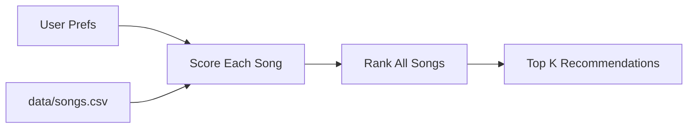

# 🎵 Music Recommender Simulation

## Project Summary

In this project you will build and explain a small music recommender system.

Your goal is to:

- Represent songs and a user "taste profile" as data
- Design a scoring rule that turns that data into recommendations
- Evaluate what your system gets right and wrong
- Reflect on how this mirrors real world AI recommenders

This version simulates a content-based music recommender that compares a user's taste profile to song attributes in `data/songs.csv`. It uses a weighted score to favor songs that match the user's preferred genre and mood, stay close to the target energy level, and optionally align with acoustic taste. Real platforms like Spotify or YouTube often combine this kind of content-based logic with collaborative filtering from other users' behavior, but this project focuses on the song features themselves so the ranking process stays transparent.

---

## How The System Works

This recommender uses a content-based scoring system. Each `Song` includes genre, mood, energy, tempo_bpm, valence, danceability, and acousticness, while the `UserProfile` stores a favorite genre, favorite mood, target energy, and whether the user prefers acoustic music. The core idea is to score one song at a time, then rank all songs by score to produce the final list of recommendations.

### Algorithm Recipe

- Add `+2.0` points for a genre match.
- Add `+1.0` point for a mood match.
- Add energy similarity points based on distance from the user's target energy, with closer songs getting more points.
- Optionally add a small bonus when `likes_acoustic` matches the song's acousticness trend.

This balance should help the system tell the difference between songs like intense rock and chill lofi. Genre should matter more than mood when the user has a strong preference, but energy should still be important so two songs in the same genre do not always tie.

### Proposed User Profile

```python
user_prefs = {
   "favorite_genre": "lofi",
   "favorite_mood": "chill",
   "target_energy": 0.4,
   "likes_acoustic": True,
}
```

This profile should rank calm, low-energy songs highly while still allowing the recommender to distinguish between a relaxed track and an overly sleepy one.

### Dataset Expansion Plan

The starter CSV is a good base, but I would expand it with 5 to 10 more songs that cover genres and moods not already represented as strongly in the starter set. Good additions would include hip hop, R&B, electronic, classical, metal, and upbeat dance tracks. I would also make sure the added songs vary across energy, valence, danceability, and acousticness so the recommender has more than one way to separate songs.

### Bias Note

This system may over-prioritize genre and energy, which could hide songs that match the user's mood but come from a different style. If the catalog is small or uneven, the recommender may also create a narrow filter bubble and keep suggesting very similar songs.

### Data Flow



In other words, the input is the user's taste profile, the process scores each song from the CSV one by one, and the output is a ranked list of the best matches. That separation makes the logic easier to explain, test, and tune.

---

## Getting Started

### Setup

1. Create a virtual environment (optional but recommended):

   ```bash
   python -m venv .venv
   source .venv/bin/activate      # Mac or Linux
   .venv\Scripts\activate         # Windows

2. Install dependencies

```bash
pip install -r requirements.txt
```

3. Run the app:

```bash
python -m src.main
```

### Running Tests

Run the starter tests with:

```bash
pytest
```

You can add more tests in `tests/test_recommender.py`.

---

## Experiments You Tried

Use this section to document the experiments you ran. For example:

- What happened when you changed the weight on genre from 2.0 to 0.5
- What happened when you added tempo or valence to the score
- How did your system behave for different types of users

---

## Limitations and Risks

Summarize some limitations of your recommender.

Examples:

- It only works on a tiny catalog
- It does not understand lyrics or language
- It might over favor one genre or mood

You will go deeper on this in your model card.

---

## Reflection

Read and complete `model_card.md`:

[**Model Card**](model_card.md)

Write 1 to 2 paragraphs here about what you learned:

- about how recommenders turn data into predictions
- about where bias or unfairness could show up in systems like this


---

## 7. `model_card_template.md`

Combines reflection and model card framing from the Module 3 guidance. :contentReference[oaicite:2]{index=2}  

```markdown
# 🎧 Model Card - Music Recommender Simulation

## 1. Model Name

Give your recommender a name, for example:

> VibeFinder 1.0

---

## 2. Intended Use

- What is this system trying to do
- Who is it for

Example:

> This model suggests 3 to 5 songs from a small catalog based on a user's preferred genre, mood, and energy level. It is for classroom exploration only, not for real users.

---

## 3. How It Works (Short Explanation)

Describe your scoring logic in plain language.

- What features of each song does it consider
- What information about the user does it use
- How does it turn those into a number

Try to avoid code in this section, treat it like an explanation to a non programmer.

---

## 4. Data

Describe your dataset.

- How many songs are in `data/songs.csv`
- Did you add or remove any songs
- What kinds of genres or moods are represented
- Whose taste does this data mostly reflect

---

## 5. Strengths

Where does your recommender work well

You can think about:
- Situations where the top results "felt right"
- Particular user profiles it served well
- Simplicity or transparency benefits

---

## 6. Limitations and Bias

Where does your recommender struggle

Some prompts:
- Does it ignore some genres or moods
- Does it treat all users as if they have the same taste shape
- Is it biased toward high energy or one genre by default
- How could this be unfair if used in a real product

---

## 7. Evaluation

How did you check your system

Examples:
- You tried multiple user profiles and wrote down whether the results matched your expectations
- You compared your simulation to what a real app like Spotify or YouTube tends to recommend
- You wrote tests for your scoring logic

You do not need a numeric metric, but if you used one, explain what it measures.

---

## 8. Future Work

If you had more time, how would you improve this recommender

Examples:

- Add support for multiple users and "group vibe" recommendations
- Balance diversity of songs instead of always picking the closest match
- Use more features, like tempo ranges or lyric themes

---

## 9. Personal Reflection

A few sentences about what you learned:

- What surprised you about how your system behaved
- How did building this change how you think about real music recommenders
- Where do you think human judgment still matters, even if the model seems "smart"

