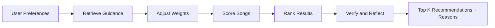

# Music Recommender Simulation

## Project Summary

This project started as the Module 3 music recommender simulation and was extended into a fuller applied AI system. It still scores songs from `data/songs.csv` against a user's taste profile, but now it also uses retrieval-augmented guidance, a visible agentic workflow trace, specialized scoring behavior, and a repeatable evaluation harness.

Real-world recommenders often mix content-based features, retrieval of product or policy guidance, and evaluation loops. This project keeps the logic explainable so it can be inspected, debugged, and discussed as a classroom-sized AI system.

## How the System Works

### Current Workflow

The current setup runs in four layers:

1. `main.py` loads the song catalog and defines the demo listener profiles.
2. `workflow.py` wraps each run in a visible agent-style trace: plan, retrieve, specialize, score, verify, reflect.
3. `document_loader.py` provides the retrieval context used by RAG when the workflow is in guided mode.
4. `recommender.py` scores every song, ranks the results, and returns human-readable reasons.

After that, `evaluation.py` compares baseline, RAG, and specialized runs so the project can show behavior differences across modes.

### Features Used

- Song features: `genre`, `mood`, `energy`, `tempo_bpm`, `valence`, `danceability`, `acousticness`
- User profile features: `favorite_genre`, `favorite_mood`, `target_energy`, `likes_acoustic`
- Retrieval guidance: document snippets about scoring rules and specialization behavior
- Workflow trace: plan, retrieve, score, verify, reflect

## Architecture Diagram


### Algorithm Recipe

- `+2.0` for genre match
- `+1.0` for mood match
- Up to `+1.5` for energy similarity (closer energy to target gets more points)
- Acoustic bonus (`+0.5` for acoustic-preferring users, `+0.2` for low-acoustic-preferring users)
- RAG slightly adjusts the weights for the current profile so retrieved guidance can influence scoring
- Specialized mode applies a different weight profile for low-energy, high-energy, or mood-focused users

The score is calculated per song, then all songs are ranked highest-to-lowest and top `k` are returned.

### Data Flow



## Evaluation Harness

Run the built-in evaluation to compare baseline, RAG, and specialized modes across the three demo profiles.

```bash
python -m src.evaluation
```

The harness reports profile counts, score comparisons, and trace length so you can summarize reliability in the README and model card.

## Setup and Run

```bash
python -m pip install -r requirements.txt
python -m src.main
```

## Run Tests

```bash
python -m pytest -q
```

## Additional Files

- Detailed model documentation: `model_card.md`
- Pairwise profile comparison notes: `reflection.md`
- Evaluation harness: `python -m src.evaluation`

## Sample Interactions

1. High-Energy Pop profile returns upbeat, high-energy songs near the top.
2. Chill Lofi profile returns low-energy, acoustic-leaning songs first.
3. Deep Intense Rock profile shifts toward energetic, genre-matched songs.

## Design Decisions

- Keep the scoring rules transparent instead of using a black-box model.
- Use RAG to ground the scoring logic in explicit project guidance.
- Use a specialized mode to demonstrate that different settings can change the ranking behavior.
- Keep the workflow trace visible so the system can be explained to a reviewer.

## Testing Summary

- Unit tests cover the recommender, retrieval loader, workflow trace, and evaluation harness.
- The project currently verifies that RAG changes scores and that the workflow emits plan/retrieve/reflect steps.
- The evaluation harness compares baseline, RAG, and specialized output across a fixed set of profiles.

## Reflection

This project taught me that a small, explainable scoring system can still behave like a real AI application when it is wrapped with retrieval, a workflow trace, and evaluation. It also showed me that documentation and testing matter as much as the ranking logic itself when the goal is a portfolio-ready system.

## Portfolio / Demo

- GitHub repository: add the final public repo link here.
- Loom walkthrough: add the video link here before submission.


