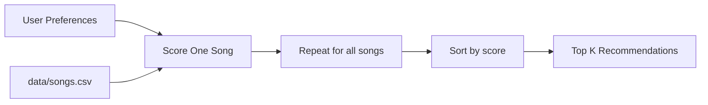

# Music Recommender Simulation

## Project Summary

This project simulates a content-based music recommender that scores songs from `data/songs.csv` against a user's taste profile. The scoring is transparent and explainable, so each recommendation includes both a numeric score and plain-language reasons.

Real-world systems (Spotify, YouTube, TikTok) often combine:

- Collaborative filtering: recommendations from crowd behavior (likes, skips, playlists, watch time)
- Content-based filtering: recommendations from item features (genre, mood, energy, tempo)

This project focuses on content-based filtering so the algorithm is easy to inspect and debug.

## How the System Works

### Features Used

- Song features: `genre`, `mood`, `energy`, `tempo_bpm`, `valence`, `danceability`, `acousticness`
- User profile features: `favorite_genre`, `favorite_mood`, `target_energy`, `likes_acoustic`

### Algorithm Recipe

- `+2.0` for genre match
- `+1.0` for mood match
- Up to `+1.5` for energy similarity (closer energy to target gets more points)
- Acoustic bonus (`+0.5` for acoustic-preferring users, `+0.2` for low-acoustic-preferring users)

The score is calculated per song, then all songs are ranked highest-to-lowest and top `k` are returned.

### Data Flow



## Phase 4 Evaluation

### Profiles Tested

- High-Energy Pop
- Chill Lofi
- Deep Intense Rock

### Observed Output Snapshot

Command used:

```bash
python -m src.main
```

Key results:

- `High-Energy Pop`: top songs were `Sunrise City`, `Gym Hero`, `Rooftop Lights`
- `Chill Lofi`: top songs were `Library Rain`, `Midnight Coding`, `Focus Flow`
- `Deep Intense Rock`: top songs were `Storm Runner`, `Gym Hero`, `Sunrise City`

### Sensitivity Experiment

Test run: halve genre weight and double max energy contribution.

- Baseline top-3 for `High-Energy Pop`: `Sunrise City`, `Gym Hero`, `Rooftop Lights`
- Weight-shift top-3 for `High-Energy Pop`: `Sunrise City`, `Gym Hero`, `Rooftop Lights`

Interpretation: ranking order stayed stable for the strongest profile matches, but score gaps changed. This suggests the current small dataset has clear high-energy winners, so modest weight changes affect confidence more than order.

### Bias and Limitations (Quick Note)

- Small dataset (10 songs) limits diversity.
- Genre and energy can dominate ranking when matches are strong.
- The model can create a mini filter bubble by repeatedly recommending similar songs.

## Setup and Run

```bash
python -m pip install -r requirements.txt
python -m src.main
```

## Run Tests

```bash
python -m pytest -q
```

## Additional Files

- Detailed model documentation: `model_card.md`
- Pairwise profile comparison notes: `reflection.md`

## 9. Personal Reflection

A few sentences about what you learned:

- What surprised you about how your system behaved
- How did building this change how you think about real music recommenders
- Where do you think human judgment still matters, even if the model seems "smart"

